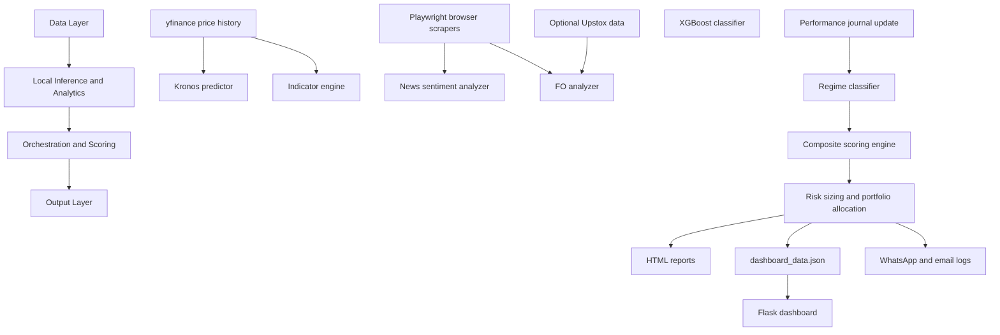

# KronosIndia Architecture and Setup Guide

KronosIndia is a local, offline-first AI stock analysis system designed for Indian equity markets. It scans a watchlist, evaluates news and F&O context, scores each symbol with multiple models, sizes trades using risk rules, and writes the results into a local dashboard and trade journal.

## Design Goals

- Keep the pipeline runnable without expensive subscriptions.
- Prefer local computation first, with graceful fallbacks when a browser scrape, model load, or API call fails.
- Preserve a performance journal so the system can learn from prior trade outcomes.
- Produce outputs that are easy to inspect locally: HTML, JSON, SQLite, and alert logs.

## High-Level Architecture



## Four Core Layers

### 1. Data Layer

The data layer collects:

- Historical prices from `yfinance`
- Live or near-live market context through Playwright-based browser scrapers
- Optional Upstox data for options and F&O context

If one source fails, the system falls back to simpler retrieval paths rather than stopping the scan.

### 2. Local Inference and Analytics

This layer evaluates each symbol with local models and indicator logic:

- `kronos/predictor.py` for the Kronos neural network forecast
- `analysis/xgboost_model.py` for probability scoring
- `analysis/indicators.py` for technical indicator math
- `analysis/news_analyzer.py` for news sentiment
- `analysis/fo_analyzer.py` for derivatives and PCR-style context

### 3. Orchestration and Scoring

`main.py` coordinates the run:

- Updates the SQLite trading journal before scanning new candidates
- Loads the current regime through `analysis/regime_filter.py`
- Combines model outputs in `analysis/scoring_engine.py`
- Filters or downweights picks using regime rules and risk constraints
- Applies `analysis/risk_manager.py` to size positions and cap exposure

### 4. Output Layer

The results are written to:

- `output/reports/` for HTML reports
- `output/dashboard_data.json` for the dashboard
- `data/trading_journal.db` for trade outcome tracking
- `output/whatsapp_log.txt` and `output/email_log.txt` for alerts and fallbacks

## Execution Flow

When you run `python main.py`, the pipeline typically follows this order:

1. Resolve pending trades from the journal.
2. Fetch prices and news for the active watchlist.
3. Pull F&O and global context.
4. Run the Kronos predictor, XGBoost classifier, and technical indicator engine.
5. Classify the market regime as trending, sideways, or volatile.
6. Score each symbol with a 100-point composite model.
7. Apply regime filtering.
8. Allocate capital using ATR-based stops and a fixed risk budget.
9. Persist outputs to HTML, JSON, and SQLite.
10. Send alert summaries through the configured notification channel.

## Fallback Strategy

The system is built to degrade gracefully.

| Component | Primary Path | Fallback |
|---|---|---|
| Price history | `yfinance` batch download | Per-ticker download or skip |
| News | Browser scraping | Static HTML parsing or keyword analysis |
| Sentiment | Local LLM | Rule-based scoring |
| Technical signals | Indicator engine + browser data | Pure math-based indicators |
| Alerts | Twilio WhatsApp | Local text log |

## Setup On Another Computer

### Prerequisites

- Python 3.8 to 3.11
- Git
- Optional: Ollama for local sentiment analysis

### Quick Setup

```bash
python setup_new_machine.py
```

This script:

- Installs the Python dependencies
- Installs Playwright Chromium
- Clones the Kronos model repository
- Creates a template `.env`

### Run the Pipeline

```bash
python main.py
```

For a smaller test run:

```bash
python main.py --limit 5
```

### Start the Dashboard

```bash
python -m output.dashboard
```

Then open:

```text
http://127.0.0.1:5000
```

## Environment Variables

The default `.env` supports:

- `OLLAMA_BASE_URL`
- `OLLAMA_MODEL`
- `OLLAMA_TIMEOUT`
- `OLLAMA_API_KEY`
- `UPSTOX_API_KEY`
- `UPSTOX_API_SECRET`
- `UPSTOX_REDIRECT_URI`
- `UPSTOX_ACCESS_TOKEN`
- `TWILIO_ACCOUNT_SID`
- `TWILIO_AUTH_TOKEN`
- `WHATSAPP_FROM`
- `WHATSAPP_TO`

## Directory Map

```text
kronos_india/
├── main.py
├── config.py
├── setup_new_machine.py
├── SETUP.md
├── kronos/
├── data/
├── analysis/
└── output/
```

## Notes

- The system is designed to keep running even when one data source is unavailable.
- The trade journal is part of the workflow, not an afterthought.
- Backtesting and calibration remain important if you want to measure whether the signals are actually improving over time.
